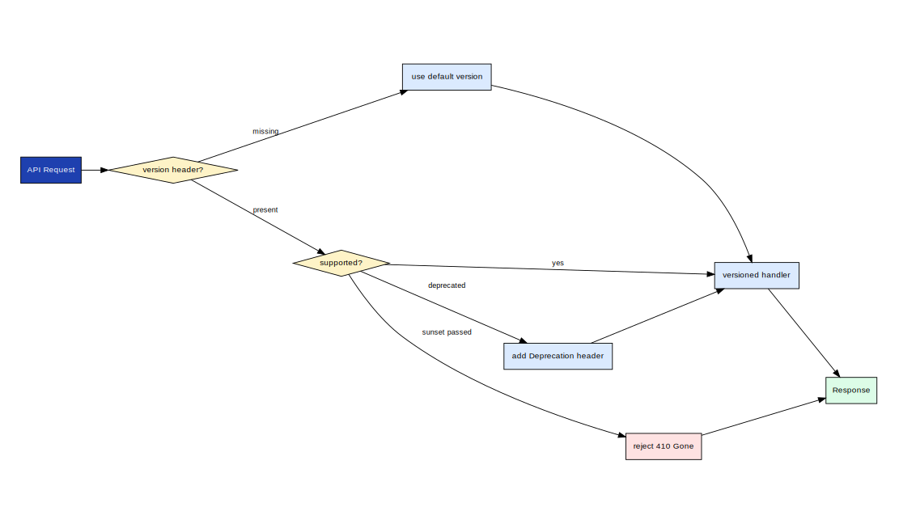
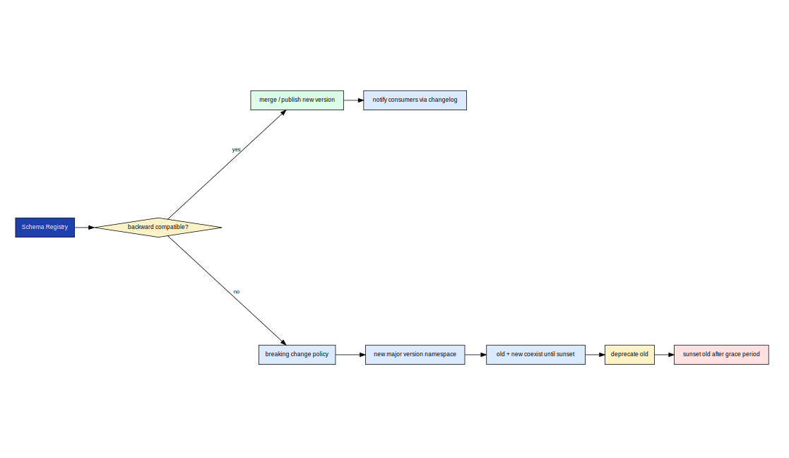
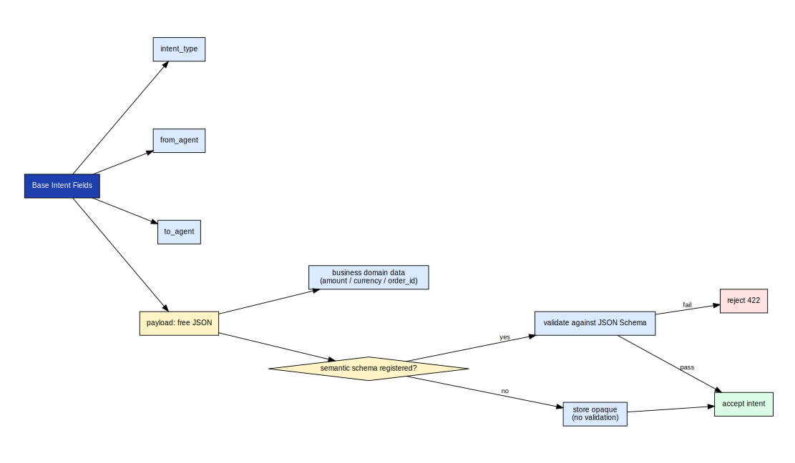
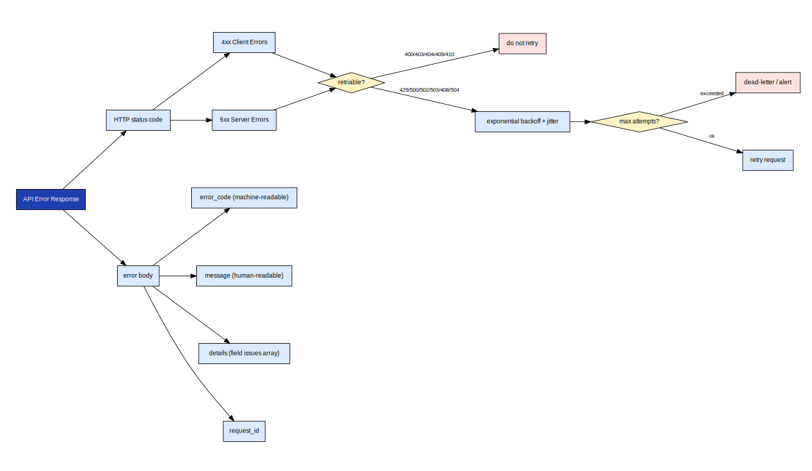

# axme-spec

**Canonical AXME protocol and public API schema repository.** This is the source of truth for all contract definitions consumed by the runtime, SDKs, documentation, and conformance suite.

> **Alpha** · Protocol and API surface are stabilizing. Not recommended for production workloads yet.  
> Feedback and schema proposals welcome → [hello@axme.ai](mailto:hello@axme.ai)

---

## What Is AXME?

AXME is a coordination infrastructure for durable execution of long-running intents across distributed systems.

It provides a model for executing **intents** — requests that may take minutes, hours, or longer to complete — across services, agents, and human participants.

## AXP — the Intent Protocol

At the core of AXME is **AXP (Intent Protocol)** — an open protocol that defines contracts and lifecycle rules for intent processing.

AXP can be implemented independently.  
The open part of the platform includes:

- the protocol specification and schemas
- SDKs and CLI for integration
- conformance tests
- implementation and integration documentation

## AXME Cloud

**AXME Cloud** is the managed service that runs AXP in production together with **The Registry** (identity and routing).

It removes operational complexity by providing:

- reliable intent delivery and retries  
- lifecycle management for long-running operations  
- handling of timeouts, waits, reminders, and escalation  
- observability of intent status and execution history  

State and events can be accessed through:

- API and SDKs  
- event streams and webhooks  
- the cloud console

---

## What Lives Here

`axme-spec` owns the normative contracts for the entire AXME platform. Everything else — the runtime, SDKs, docs, and conformance tests — is derived from or validated against this repository.

```
axme-spec/
├── schemas/
│   ├── protocol/              # AXP wire protocol definitions (envelope, frames, versioning)
│   └── public_api/            # Public REST API contracts (request/response/error schemas)
├── docs/
│   ├── diagrams/              # Schema-level visualizations
│   ├── compatibility-policy.md
│   ├── schema-governance.md
│   └── versioning-strategy.md
└── scripts/
    └── validate_schemas.py
```

---

## Protocol Envelope

The AXP envelope wraps every intent. It carries the payload, sender identity, schema version, idempotency key, and a cryptographic signature applied at the gateway boundary.


*Each field in the envelope is normatively defined here. The runtime and all SDKs must conform to these field names, types, and validation rules.*

---

## Schema Versioning and Deprecation

Schemas follow a three-phase lifecycle: stable → deprecated → removed. Breaking changes require a new major schema version. Additive changes are backward-compatible.



*A schema version enters deprecation with a minimum 90-day notice period. Clients targeting a deprecated version receive `Deprecation` response headers. Removal is announced in the migration guide.*

---

## Schema Governance and Compatibility

All schema changes go through a governance review before landing. The compatibility matrix ensures no existing consumer breaks across patch and minor versions.



*Governance steps: proposal → impact analysis → compatibility check → reviewer sign-off → merge → changelog entry → docs sync.*

---

## Intent Payload Extensibility

Intent schemas are typed by `intent_type`. The payload field is a structured JSON object defined per type — not a free-form blob. This ensures every intent carries a machine-readable, versioned contract.



*Businesses define their own `intent_type` namespaces. The platform validates the payload against the registered schema for that type. Custom fields are allowed in designated extension zones.*

---

## Public API Error Model

All error responses follow a uniform model: HTTP status + machine-readable error code + retriability hint.



*`4xx` errors are client errors and are not retried. `5xx` errors carry a `Retry-After` hint. Idempotency-safe operations can be safely retried with the original idempotency key.*

---

## Integration Rule

A contract family is considered complete only when it is aligned across all five layers:

1. **`axme-spec`** — normative schema definition (this repo)
2. **`axme-docs`** — OpenAPI artifact and narrative documentation
3. **SDK clients** — implemented and tested method in each of the five SDKs
4. **`axme-conformance`** — conformance check covering the contract
5. **Runtime** — `axme-control-plane` behavior matches the schema

---

## Validation

```bash
python -m pip install -e ".[dev]"
python scripts/validate_schemas.py
pytest
```

---

## Related Repositories

| Repository | Relationship |
|---|---|
| [axme-docs](https://github.com/AxmeAI/axme-docs) | Derives OpenAPI artifacts and narrative docs from these schemas |
| [axme-conformance](https://github.com/AxmeAI/axme-conformance) | Validates runtime and SDK behavior against these contracts |
| Control-plane runtime (private) | Runtime implementation must conform to schemas defined here |
| [axme-sdk-python](https://github.com/AxmeAI/axme-sdk-python) | Python client — API surface derived from these contracts |
| [axme-sdk-typescript](https://github.com/AxmeAI/axme-sdk-typescript) | TypeScript client |
| [axme-sdk-go](https://github.com/AxmeAI/axme-sdk-go) | Go client |
| [axme-sdk-java](https://github.com/AxmeAI/axme-sdk-java) | Java client |
| [axme-sdk-dotnet](https://github.com/AxmeAI/axme-sdk-dotnet) | .NET client |

---

## Contributing & Contact

- Schema proposals and breaking-change requests: open an issue with label `schema-proposal`
- Alpha access: https://cloud.axme.ai/alpha · Contact and suggestions: [hello@axme.ai](mailto:hello@axme.ai)
- Security disclosures: see [SECURITY.md](SECURITY.md)
- Contribution guidelines: [CONTRIBUTING.md](CONTRIBUTING.md)
